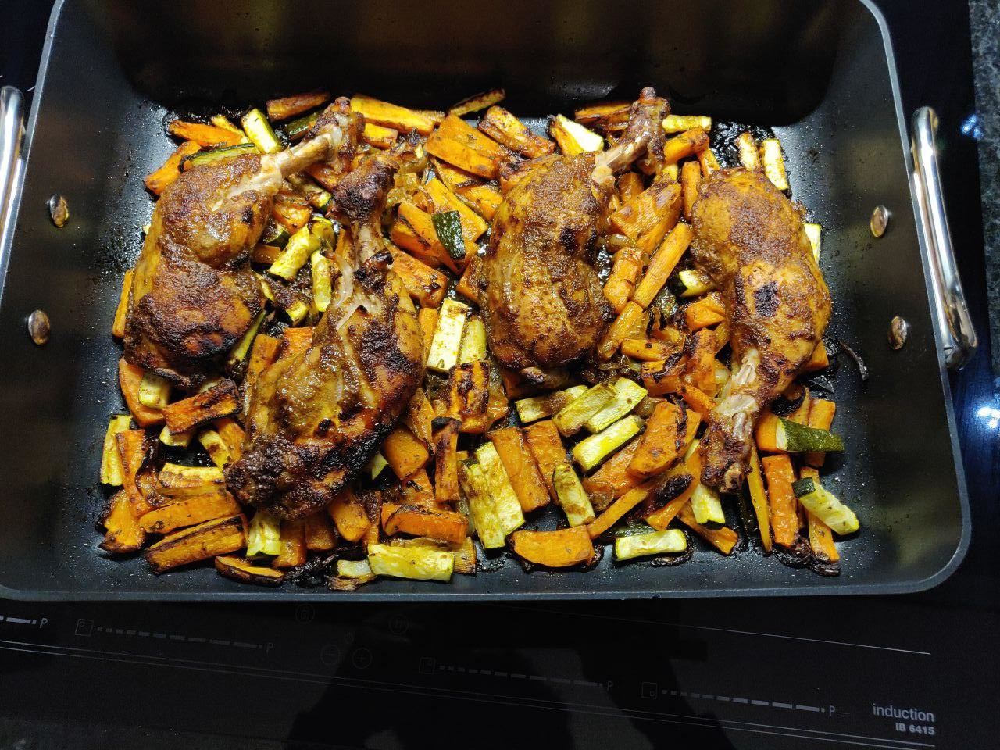

# Roasted Chiken Thighs

This recipe is for 2 to 3 people.

## Ingredients

- 4 chicken thighs
- 1 to 2 sweet potatoes
- 1 to 2 zucchinis
- 1 to 2 carrots
- 3 onions
- olive oil
- brown balsamic vinegar
- garlic powder
- salt
- pepper
- maple syrup (or date syrup)
- barbecue sauce

## Chicken Preparation

1. Remove the skin from the thighs and make a few holes in the thighs using a fork (to allow the sauce to get into the flesh).
2. In a bowl, mix the following together to get the sauce:

  - olive oil
  - the garlic (do not hesitate to put much)
  - balsamic vinegar
  - salt
  - pepper
  - a tiny bit of maple syrup
  - any other spice you want that could add taste (eg. paprika, BBQ spice, meat spice, ...)

3. Put the chicken in a ziplock bag and add the sauce in it and shake it (or move its content with your hands) to make the sauce cover the chicken.

4. Put the ziplock bag containing the chicken and the sauce in the fridge for a few hours (24 hours for best result).

## Vegetables

1. Cut the following in slices (or small pieces) and put them in an oven pan:

  - carrots
  - sweet potatoes
  - onions

2. Pour a bit of oil on the vegetables.

3. Cut the zucchinis in slices.

## Cooking

1. Put the pan containing the vegetables in the oven (pre-heated at 190 °C fanned air) and let it cook for 15 minutes.
2. Add the zucchini slices and the chicken thighs in the pan and put it back in the oven to let it cook for approximately 25 minutes. _You can pour the rest of the chicken sauce on the chickend thighs and the vegetables._

If you want to add more sauce to the meal, you can make an [aïoli garlic sauce](/sauces/aioli_sauce.md).
